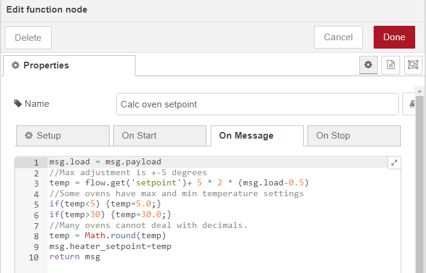
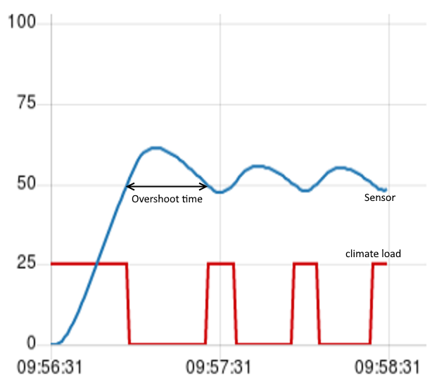

# Cascade temperature control

## Description

The controller changes the setpoint of climate entities to regulate the temperature of room with increased responsiveness, accuracy, and stability.

### An example

A room has a temperature sensor and en electric heater. Given a setpoint temperature, the controller can make the sensor match the given value by adjusting the temperature settings of the electric heater. This type of control usually reacts faster and is more accurate then the alternative of simply changing the temperature settings of the heater. The flow requires that node-red, home assistant, and the connection to the climate entity are stable.


The example utilizes a PID controller to provide a number between 0 and 1 to indicate a load on the heater

A cascade temperature controller is a controller which utilizes the input/setpoints of other controllers/climate entities to regulate to its own setpoint

---

## Requirements

> Home assistant integrated with Node-RED

> The PID node installed - https://flows.nodered.org/node/node-red-contrib-pid

> A climate entity

## Instructions

> Create an `input_number` entity in Home Assistant and name it "cascade_setpoint"

> Create an `input_boolean` entity in Home Assistant and name it `cascade_enabled`

- When set to false, this will disengage the controller

> Import the flow into Node-RED

> Enter the correct sensor tempertaure entity in the `Temp sensor` node

> Change the climate entity name in three places

- Current climate settings - node
- Set Temperature node - two places
  - `Entity ID`
  - `Data`

> (optional) Change the oven setpoint range - see figure below.

- This regulates what values the controller sends to the oven. As a default, the value sent is oven_setpoint = setpoint +- 5 degrees. That is, for a setoint of 10C, the controller will be sending setpoints between 5 and 15 C to the oven. This is further limited to whole numbers, a minimum value of 5, and a maximum value of 30.

> (reccomended) Tune the PID controller - Detailed instructions can be found here: http://blog.clanlaw.org.uk/pid-loop-tuning.html

- Measure the system and find the overshoot time
  - Set the proportional band to **zero** and place the setpoint a bit above the current measured value (se figure).
  - Wait for the system to overshoot the target temperature and measure the time it takes for the system to return to the setpoint.
- Set the proportional band. This is the value indicates how much the measured temperature is allowed to deviate from the setpoint before max load is applied.
- Spesify the integral time. A good value is two times the overshoot time.
- Insert the derivative time. A good value here is half of the overshoot time.




---

## Flow

---

<details>
  <summary>Click to expand!</summary>

```json:no-line-numbers
[
  {
    "id": "29fde6c61057362b",
    "type": "tab",
    "label": "PID Controller - cascade",
    "disabled": false,
    "info": "",
    "env": []
  },
  {
    "id": "61ae0bee1a382102",
    "type": "server-state-changed",
    "z": "29fde6c61057362b",
    "name": "Setpoint",
    "server": "e2dd69fb.8f70a8",
    "version": 3,
    "exposeToHomeAssistant": false,
    "haConfig": [
      { "property": "name", "value": "" },
      { "property": "icon", "value": "" }
    ],
    "entityidfilter": "input_number.cascade_setpoint",
    "entityidfiltertype": "exact",
    "outputinitially": true,
    "state_type": "num",
    "haltifstate": "",
    "halt_if_type": "str",
    "halt_if_compare": "is",
    "outputs": 1,
    "output_only_on_state_change": false,
    "for": 0,
    "forType": "num",
    "forUnits": "minutes",
    "ignorePrevStateNull": false,
    "ignorePrevStateUnknown": false,
    "ignorePrevStateUnavailable": false,
    "ignoreCurrentStateUnknown": true,
    "ignoreCurrentStateUnavailable": true,
    "outputProperties": [
      { "property": "payload", "propertyType": "msg", "value": "", "valueType": "entityState" },
      { "property": "data", "propertyType": "msg", "value": "", "valueType": "eventData" },
      { "property": "topic", "propertyType": "msg", "value": "", "valueType": "triggerId" }
    ],
    "x": 120,
    "y": 100,
    "wires": [["f8958d382348c254"]]
  },
  {
    "id": "ef1c6050d6de41c7",
    "type": "server-state-changed",
    "z": "29fde6c61057362b",
    "name": "Temp. sensor",
    "server": "e2dd69fb.8f70a8",
    "version": 3,
    "exposeToHomeAssistant": false,
    "haConfig": [
      { "property": "name", "value": "" },
      { "property": "icon", "value": "" }
    ],
    "entityidfilter": "sensor.kjokken_temp",
    "entityidfiltertype": "exact",
    "outputinitially": true,
    "state_type": "num",
    "haltifstate": "",
    "halt_if_type": "str",
    "halt_if_compare": "is",
    "outputs": 1,
    "output_only_on_state_change": false,
    "for": 0,
    "forType": "num",
    "forUnits": "seconds",
    "ignorePrevStateNull": false,
    "ignorePrevStateUnknown": false,
    "ignorePrevStateUnavailable": false,
    "ignoreCurrentStateUnknown": true,
    "ignoreCurrentStateUnavailable": true,
    "outputProperties": [
      { "property": "payload", "propertyType": "msg", "value": "", "valueType": "entityState" },
      { "property": "data", "propertyType": "msg", "value": "", "valueType": "eventData" },
      { "property": "topic", "propertyType": "msg", "value": "", "valueType": "triggerId" }
    ],
    "x": 130,
    "y": 160,
    "wires": [["ee1904546f36bdcb"]]
  },
  {
    "id": "f8958d382348c254",
    "type": "function",
    "z": "29fde6c61057362b",
    "name": "Specify topic",
    "func": "msg.topic = \"setpoint\"\nflow.set('setpoint',msg.payload)\nreturn msg",
    "outputs": 1,
    "noerr": 0,
    "initialize": "",
    "finalize": "",
    "libs": [],
    "x": 270,
    "y": 100,
    "wires": [["6f77dd60c21180e1"]]
  },
  {
    "id": "6f77dd60c21180e1",
    "type": "PID",
    "z": "29fde6c61057362b",
    "name": "",
    "setpoint": "7",
    "pb": "0.6",
    "ti": "3600",
    "td": "900",
    "integral_default": 0.5,
    "smooth_factor": "2",
    "max_interval": "600",
    "enable": 1,
    "disabled_op": 0,
    "x": 430,
    "y": 140,
    "wires": [["ea6adedb7e2fc14e"]]
  },
  {
    "id": "ea6adedb7e2fc14e",
    "type": "function",
    "z": "29fde6c61057362b",
    "name": "Calc oven setpoint",
    "func": "msg.load = msg.payload\n//Max adjustment is +-5 degrees\ntemp = flow.get('setpoint')+ 5 * 2 * (msg.load-0.5)\n//Some ovens have max and min temperature settings\nif(temp<5) {temp=5.0;}\nif(temp>30) {temp=30.0;}\n//Many ovens cannot deal with decimals.\ntemp = Math.round(temp)\nmsg.heater_setpoint=temp\nreturn msg",
    "outputs": 1,
    "noerr": 0,
    "initialize": "",
    "finalize": "",
    "libs": [],
    "x": 590,
    "y": 140,
    "wires": [["45925567a1177d5b"]]
  },
  {
    "id": "5fa07ec0c1842823",
    "type": "api-current-state",
    "z": "29fde6c61057362b",
    "name": "Current climate settings",
    "server": "e2dd69fb.8f70a8",
    "version": 3,
    "outputs": 1,
    "halt_if": "",
    "halt_if_type": "str",
    "halt_if_compare": "is",
    "entity_id": "climate.my_climate",
    "state_type": "str",
    "blockInputOverrides": false,
    "outputProperties": [
      { "property": "payload", "propertyType": "msg", "value": "", "valueType": "entityState" },
      { "property": "data", "propertyType": "msg", "value": "", "valueType": "entity" }
    ],
    "for": 0,
    "forType": "num",
    "forUnits": "minutes",
    "x": 950,
    "y": 140,
    "wires": [["ba7e48582e04c14c", "0a7c09c92a01178e"]]
  },
  {
    "id": "ba7e48582e04c14c",
    "type": "switch",
    "z": "29fde6c61057362b",
    "name": "Not same?",
    "property": "data.attributes.temperature",
    "propertyType": "msg",
    "rules": [{ "t": "neq", "v": "heater_setpoint", "vt": "msg" }],
    "checkall": "true",
    "repair": false,
    "outputs": 1,
    "x": 1150,
    "y": 140,
    "wires": [["1114bb7e63d16e98", "0a7c09c92a01178e"]]
  },
  {
    "id": "1114bb7e63d16e98",
    "type": "api-call-service",
    "z": "29fde6c61057362b",
    "name": "Sett temperatur",
    "server": "e2dd69fb.8f70a8",
    "version": 3,
    "debugenabled": false,
    "service_domain": "climate",
    "service": "set_temperature",
    "entityId": "climate.my_climate",
    "data": "{\"entity_id\":\"climate.my_climate\",\"temperature\":\"{{heater_setpoint}}\"}",
    "dataType": "json",
    "mergecontext": "",
    "mustacheAltTags": false,
    "outputProperties": [],
    "queue": "none",
    "x": 1320,
    "y": 140,
    "wires": [[]]
  },
  {
    "id": "45925567a1177d5b",
    "type": "api-current-state",
    "z": "29fde6c61057362b",
    "name": "Enabled?",
    "server": "e2dd69fb.8f70a8",
    "version": 3,
    "outputs": 2,
    "halt_if": "true",
    "halt_if_type": "bool",
    "halt_if_compare": "is",
    "entity_id": "input_boolean.cascade_enabled",
    "state_type": "habool",
    "blockInputOverrides": false,
    "outputProperties": [
      { "property": "enabled", "propertyType": "msg", "value": "", "valueType": "entityState" },
      { "property": "data", "propertyType": "msg", "value": "", "valueType": "entity" }
    ],
    "for": 0,
    "forType": "num",
    "forUnits": "minutes",
    "x": 760,
    "y": 140,
    "wires": [["5fa07ec0c1842823"], []]
  },
  {
    "id": "0a7c09c92a01178e",
    "type": "debug",
    "z": "29fde6c61057362b",
    "name": "",
    "active": false,
    "tosidebar": true,
    "console": false,
    "tostatus": false,
    "complete": "true",
    "targetType": "full",
    "statusVal": "",
    "statusType": "auto",
    "x": 1330,
    "y": 240,
    "wires": []
  },
  {
    "id": "ee1904546f36bdcb",
    "type": "delay",
    "z": "29fde6c61057362b",
    "name": "",
    "pauseType": "delay",
    "timeout": "100",
    "timeoutUnits": "milliseconds",
    "rate": "1",
    "nbRateUnits": "1",
    "rateUnits": "second",
    "randomFirst": "1",
    "randomLast": "5",
    "randomUnits": "seconds",
    "drop": false,
    "allowrate": false,
    "outputs": 1,
    "x": 290,
    "y": 160,
    "wires": [["6f77dd60c21180e1"]]
  },
  {
    "id": "e2dd69fb.8f70a8",
    "type": "server",
    "name": "Home Assistant",
    "version": 2,
    "addon": true,
    "rejectUnauthorizedCerts": true,
    "ha_boolean": "y|yes|true|on|home|open",
    "connectionDelay": false,
    "cacheJson": true,
    "heartbeat": true,
    "heartbeatInterval": "30"
  }
]
```

</details>
